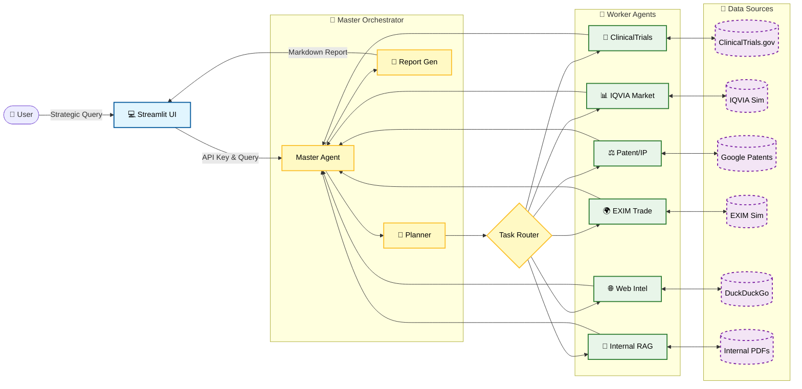
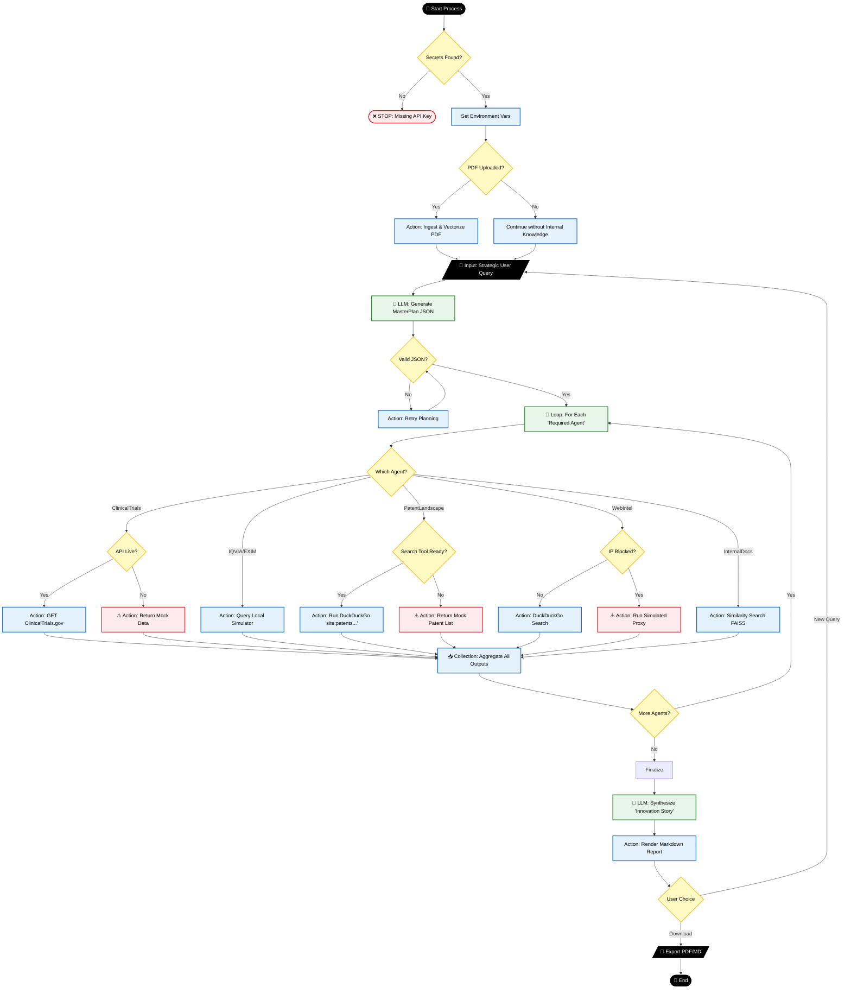

# EY_Pharma_Agent

```mermaid
graph LR
    %% Styling
    classDef ui fill:#e1f5fe,stroke:#01579b,stroke-width:2px,color:#000;
    classDef orch fill:#fff9c4,stroke:#fbc02d,stroke-width:2px,color:#000;
    classDef agent fill:#e8f5e9,stroke:#2e7d32,stroke-width:2px,color:#000;
    classDef data fill:#f3e5f5,stroke:#7b1fa2,stroke-width:2px,stroke-dasharray: 5 5,color:#000;

    %% Layer 1: User Interface
    User([👤 User]) -->|Strategic Query| UI[💻 Streamlit UI]
    UI -->|API Key & Query| MA_Node

    %% Layer 2: Orchestration
    subgraph Orchestrator ["🧠 Master Orchestrator"]
        MA_Node[Master Agent]
        Planner[📝 Planner]
        Synthesizer[📄 Report Gen]
    end

    MA_Node --> Planner
    Planner --> Router{Task Router}

    %% Layer 3: Worker Agents
    subgraph Workers ["👷 Worker Agents"]
        direction TB
        CT_Agent[💊 ClinicalTrials]
        IQ_Agent[📊 IQVIA Market]
        PL_Agent[⚖️ Patent/IP]
        EX_Agent[🌍 EXIM Trade]
        WI_Agent[🌐 Web Intel]
        IK_Agent[📂 Internal RAG]
    end

    Router --> CT_Agent & IQ_Agent & PL_Agent & EX_Agent & WI_Agent & IK_Agent

    %% Layer 4: Data Sources
    subgraph Data ["💽 Data Sources"]
        CT_API[(ClinicalTrials.gov)]
        IQ_Mock[(IQVIA Sim)]
        Pat_Search[(Google Patents)]
        EX_Mock[(EXIM Sim)]
        DDG[(DuckDuckGo)]
        RAG[(Internal PDFs)]
    end

    CT_Agent <--> CT_API
    IQ_Agent <--> IQ_Mock
    PL_Agent <--> Pat_Search
    EX_Agent <--> EX_Mock
    WI_Agent <--> DDG
    IK_Agent <--> RAG

    %% Return Flow
    CT_Agent & IQ_Agent & PL_Agent & EX_Agent & WI_Agent & IK_Agent --> MA_Node
    MA_Node --> Synthesizer
    Synthesizer -->|Markdown Report| UI

    %% Apply Styles
    class UI ui;
    class MA_Node,Planner,Synthesizer,Router orch;
    class CT_Agent,IQ_Agent,PL_Agent,EX_Agent,WI_Agent,IK_Agent agent;
    class CT_API,IQ_Mock,Pat_Search,EX_Mock,DDG,RAG data;
```

```mermaid
flowchart TD
    %% --- SHAPES & STYLES ---
    classDef startend fill:#000,stroke:#fff,stroke-width:2px,color:#fff;
    classDef action fill:#e3f2fd,stroke:#1565c0,stroke-width:2px,color:#000;
    classDef decision fill:#fff9c4,stroke:#fbc02d,stroke-width:2px,color:#000;
    classDef llm fill:#e8f5e9,stroke:#2e7d32,stroke-width:2px,color:#000;
    classDef error fill:#ffebee,stroke:#c62828,stroke-width:2px,color:#000;

    %% --- 1. INITIALIZATION LOGIC ---
    Start([🚀 Start Process]) --> CheckSecrets{Secrets Found?}
    CheckSecrets -- No --> StopError([❌ STOP: Missing API Key])
    CheckSecrets -- Yes --> SetEnv[Set Environment Vars]
    
    SetEnv --> CheckPDF{PDF Uploaded?}
    CheckPDF -- Yes --> IndexPDF[Action: Ingest & Vectorize PDF]
    CheckPDF -- No --> SkipPDF[Continue without Internal Knowledge]

    IndexPDF & SkipPDF --> GetInput[/👤 Input: Strategic User Query/]

    %% --- 2. ORCHESTRATION LOGIC ---
    GetInput --> LLM_Plan[🧠 LLM: Generate MasterPlan JSON]
    LLM_Plan --> ParseJSON{Valid JSON?}
    
    ParseJSON -- No --> RetryPlan[Action: Retry Planning]
    RetryPlan --> ParseJSON
    ParseJSON -- Yes --> IterateAgents[🔄 Loop: For Each 'Required Agent']

    %% --- 3. EXECUTION LOGIC (The "Switch" Case) ---
    IterateAgents --> CheckAgent{Which Agent?}
    
    %% Path A: Clinical Trials
    CheckAgent -- ClinicalTrials --> CallCT{API Live?}
    CallCT -- Yes --> FetchCT[Action: GET ClinicalTrials.gov]
    CallCT -- No --> FallbackCT[⚠️ Action: Return Mock Data]

    %% Path B: Proprietary Data (Simulators)
    CheckAgent -- IQVIA/EXIM --> RunSim[Action: Query Local Simulator]
    
    %% Path C: Patent Search
    CheckAgent -- PatentLandscape --> CallSearch{Search Tool Ready?}
    CallSearch -- Yes --> RunDDG[Action: Run DuckDuckGo 'site:patents...']
    CallSearch -- No --> FallbackPat[⚠️ Action: Return Mock Patent List]

    %% Path D: Web Search
    CheckAgent -- WebIntel --> CallWeb{IP Blocked?}
    CallWeb -- No --> RealWeb[Action: DuckDuckGo Search]
    CallWeb -- Yes --> ProxyWeb[⚠️ Action: Run Simulated Proxy]

    %% Path E: Internal Knowledge
    CheckAgent -- InternalDocs --> QueryVec[Action: Similarity Search FAISS]

    %% --- 4. AGGREGATION & REPORTING ---
    FetchCT & FallbackCT & RunSim & RunDDG & FallbackPat & RealWeb & ProxyWeb & QueryVec --> CollectData[📥 Collection: Aggregate All Outputs]
    
    CollectData --> NextAgent{More Agents?}
    NextAgent -- Yes --> IterateAgents
    NextAgent -- No --> Finalize

    Finalize --> LLM_Synth[📝 LLM: Synthesize 'Innovation Story']
    LLM_Synth --> Render[Action: Render Markdown Report]
    
    Render --> UserAction{User Choice}
    UserAction -- Download --> Export[/📄 Export PDF/MD/]
    UserAction -- New Query --> GetInput
    
    Export --> End([🏁 End])

    %% --- APPLY STYLES ---
    class Start,End,StopError,GetInput,Export startend;
    class SetEnv,IndexPDF,SkipPDF,RetryPlan,FetchCT,FallbackCT,RunSim,RunDDG,FallbackPat,RealWeb,ProxyWeb,QueryVec,CollectData,Render action;
    class CheckSecrets,CheckPDF,ParseJSON,CheckAgent,CallCT,CallSearch,CallWeb,NextAgent,UserAction decision;
    class LLM_Plan,LLM_Synth,IterateAgents llm;
    class StopError,FallbackCT,FallbackPat,ProxyWeb error;
```
